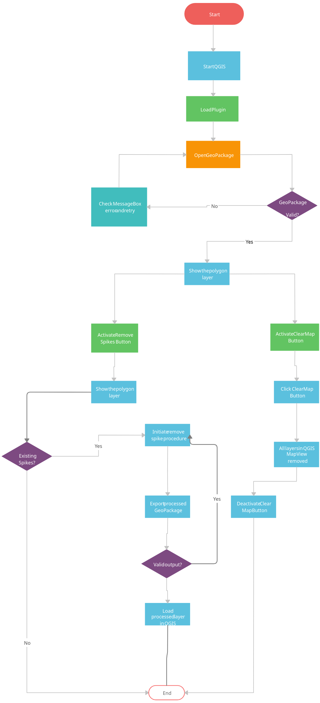
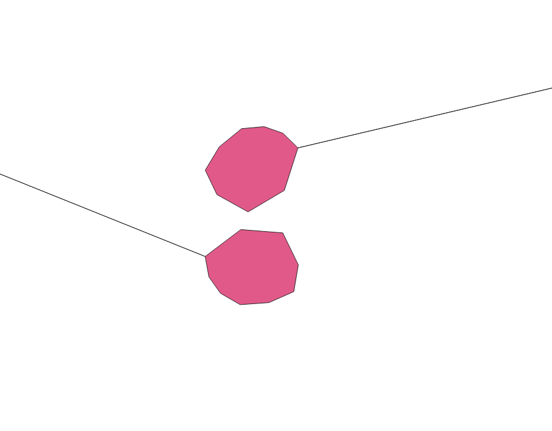

<div id="top"></div>
<!--
*** Thanks for checking out the Best-README-Template. If you have a suggestion
*** that would make this better, please fork the repo and create a pull request
*** or simply open an issue with the tag "enhancement".
*** Don't forget to give the project a star!
*** Thanks again! Now go create something AMAZING! :D
-->


<!-- PROJECT SHIELDS -->
<!--
*** I'm using markdown "reference style" links for readability.
*** Reference links are enclosed in brackets [ ] instead of parentheses ( ).
*** See the bottom of this document for the declaration of the reference variables
*** for contributors-url, forks-url, etc. This is an optional, concise syntax you may use.
*** https://www.markdownguide.org/basic-syntax/#reference-style-links
-->


<!-- PROJECT LOGO -->
<br />
<div align="center">
  <a href="https://github.com/jkariukidev/polygon_spike_remover">
    
  </a>

  <h3 align="center">Polygon Spike Remover</h3>

  <p align="center">
    A spike remover QGIS plugin
    <br />
    <br />
    <br />
    <a href="https://github.com/jkariukidev/polygon_spike_remover">View Workflow</a>
    ·
    <a href="https://github.com/jkariukidev/polygon_spike_remover/issues">Report Bug</a>
    ·
    <a href="https://github.com/jkariukidev/polygon_spike_remover/issues">Request Feature</a>
  </p>
</div>


<!-- TABLE OF CONTENTS -->
<details>
  <summary>Table of Contents</summary>
  <ol>
    <li>
      <a href="#about-the-project">About The Project</a>
      <ul>
        <li><a href="#built-with">Built With</a></li>
      </ul>
    </li>
    <li>
      <a href="#getting-started">Getting Started</a>
      <ul>
        <li><a href="#prerequisites">Prerequisites</a></li>
        <li><a href="#installation">Installation</a></li>
      </ul>
    </li>
    <li><a href="#usage">Usage</a></li>
    <li><a href="#roadmap">Roadmap</a></li>
    <li><a href="#contributing">Contributing</a></li>
    <li><a href="#license">License</a></li>
    <li><a href="#contact">Contact</a></li>
    <li><a href="#acknowledgments">Acknowledgments</a></li>
  </ol>
</details>


<!-- ABOUT THE PROJECT -->
## About The Project

[![Product Name Screen Shot][product-screenshot]](img/readme/user_interface.png)

The Spike Removal is a QGIS Desktop plugin that loads an OGC GeoPackage polygon layer,checks for existing spikes
and then removes them saving the cleaned data in a new GeoPackage file.
The main steps are three:
* Clone this repository or download in the correct section.
* Ensuring QGIS Desktop is already installed, copy the plugin to the QGIS Plugin directory
* Load the geopackage data into QGIS and activate the plugin.
* Process the GeoPackge layers and save in the appropriate location.

<p align="right">(<a href="#top">back to top</a>)</p>


### Built With

This section should list any major frameworks/libraries used to build this project.

* [Python](https://python.org/)
* [QGIS](https://qgis.org/)
* [PyQt5](https://www.riverbankcomputing.com/software/pyqt/)
* [GeoPandas](https://geopandas.org/)
* [Shapely](https://github.com/shapely/shapely)
* [PyProj](https://pyproj4.github.io/pyproj/)


<p align="right">(<a href="#top">back to top</a>)</p>


<!-- GETTING STARTED -->
## Getting Started

Clone this project using ```git```.

### Prerequisites

This is an example of how to list things you need to use the software and how to install them.
* QGIS Desktop 3.0+
* PyQt5
* Python + pip

### Installation

Below is an example of how you can install the components making up the plugin ecosystem

1. Install QGIS, Python, PyQt5
2. Clone the repo
   ```sh
   git clone https://github.com/jkariukidev/polygon_spike_remover.git
   ```
3. Install requirements such as QGIS Desktop, Python, Pip and PyQt5
4. Run QGIS Desktop and use the plugin

<p align="right">(<a href="#top">back to top</a>)</p>

### Development Workflow

The development workflow procdure is as shown below:
<a href="https://github.com/jkariukidev/">
    
  </a>

<p align="right">(<a href="#top">back to top</a>)</p>


### Input

<a href="https://github.com/jkariukidev/">
    
  </a>

<p align="right">(<a href="#top">back to top</a>)</p>

### Output

<a href="https://github.com/jkariukidev/">
    
  </a>

<p align="right">(<a href="#top">back to top</a>)</p>


<!-- USAGE EXAMPLES -->
## Usage

The usual libraries and processes of QGIS Desktop (from tests) cannot be able to identify spikes in polygons as invalid 
geometries.

<p align="right">(<a href="#top">back to top</a>)</p>


<!-- ROADMAP -->
## Roadmap

- [x] Add Changelog
- [x] Enhancements
- [ ] Automated more unit test
- [ ] Add "components" document to easily copy & paste sections of the readme
- [ ] Multi-language Support

See the [open issues](https://github.com/othneildrew/Best-README-Template/issues) for a full list of proposed features (and known issues).

<p align="right">(<a href="#top">back to top</a>)</p>


<!-- CONTRIBUTING -->
## Contributing

Contributions are what make the open source community such an amazing place to learn, inspire, and create. Any contributions you make are **greatly appreciated**.

If you have a suggestion that would make this better, please fork the repo and create a pull request. You can also simply open an issue with the tag "enhancement".
Don't forget to give the project a star! Thanks again!

1. Fork the Project
2. Create your Feature Branch (`git checkout -b feature/AmazingFeature`)
3. Commit your Changes (`git commit -m 'Add some AmazingFeature'`)
4. Push to the Branch (`git push origin feature/AmazingFeature`)
5. Open a Pull Request

<p align="right">(<a href="#top">back to top</a>)</p>


<!-- LICENSE -->
## License

Distributed under the GNU GPL License. See `LICENSE.txt` for more information.

<p align="right">(<a href="#top">back to top</a>)</p>


<!-- CONTACT -->
## Contact

Joseph Kariuki - [@jkariukidev](https://twitter.com/jkariukidev) - contact@josephkaruki.com

Project Link: [https://github.com/jkariukidev/polygon_spike_remover](https://github.com/jkariukidev/polygon_spike_remover)

<p align="right">(<a href="#top">back to top</a>)</p>


<!-- ACKNOWLEDGMENTS -->
## Acknowledgments

Use this space to list resources you find helpful and would like to give credit to. I've included a few of my favorites to kick things off!

* [PQGIS Developer Cookbook](https://docs.qgis.org/3.16/en/docs/pyqgis_developer_cookbook/index.html)
* [QGIS API ](https://www.qgis.org/api/)
* [PyQt5 API](https://doc.qt.io/qtforpython/)
* [GitHub Pages](https://pages.github.com)

<p align="right">(<a href="#top">back to top</a>)</p>


<!-- MARKDOWN LINKS & IMAGES -->
<!-- https://www.markdownguide.org/basic-syntax/#reference-style-links -->
[contributors-shield]: https://img.shields.io/github/contributors/jkariukidev/polygon_pike_remover.svg?style=for-the-badge
[contributors-url]: https://github.com/jkariukidev/polygon_spike_remover/graphs/contributors
[forks-shield]: https://img.shields.io/github/forks/jkariukidev/polygon_spike_remover.svg?style=for-the-badge
[forks-url]: https://github.com/jkariukidev/polygon_spike_remover/network/members
[stars-shield]: https://img.shields.io/github/stars/jkariukidev/polygon_spike_remover.svg?style=for-the-badge
[stars-url]: https://github.com/jkariuki/polygon_spike_remover/stargazers
[issues-shield]: https://img.shields.io/github/issues/jkariukidev/polygon_spike_remover.svg?style=for-the-badge
[issues-url]: https://github.com/jkariukidev/polygon_spike_remover/issues
[license-shield]: https://img.shields.io/github/license/jkariukidev/.svg?style=for-the-badge
[license-url]: https://github.com/jkariuki/polygon_spike_remover/blob/master/LICENSE.txt
[linkedin-shield]: https://img.shields.io/badge/-LinkedIn-black.svg?style=for-the-badge&logo=linkedin&colorB=555
[linkedin-url]: https://linkedin.com/in/josephkariuki
[product-screenshot]: img/readme/user_interface.png

[//]: # ([development-workflow]: img/readme/development_workflow.png)
